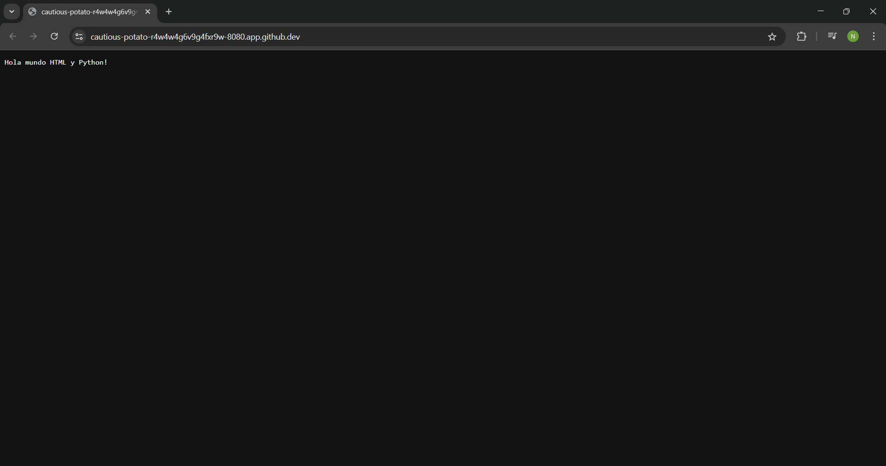

# 1. Hola mundo del web.py
Este **README** ayudará a saber para que sirve cada línea de código, ya que puede que no recuerde para que servía alguna de estas líneas.


## 1. Código web.py
Este código nos ayudará a poder crear nuestra aplicación web desde **web.py** a tráves del lenguaje de programación **Python**.

````python
import web

urls = (
    '/', 'Index'
)

app = web.application(urls, globals())

class Index:
    def GET(self):
        return 'Hola mundo HTML y Python!'

if __name__ == "__main__":
    app.run()
````


## 2. Importar librerías
Esta línea del código nos ayudará a importar librerías para nuestra aplicación web, en este caso, se importara la librería **web.py**

````python
import web
````
### Nota:
Recuerda instalar la librería antes de importarla, para ello escribiremos en la terminal de nuestro código el siguiente comando:

````shell
pip install web.py
````


## 3. Ruta
Esta parte del código utiliza la ruta para que nuestra aplicación web pueda ser vista a través de una **urls**, en esta ocasión ocupamos la ruta ya que el **Framework "web.py"** la necesita para mostrarnos lo que queremos ver.

````python
urls = (
    '/', 'Index'
)
````

### Nota:
Un **Framework** son herramientas para que podamos desarrollar sistemas como aplicaciones.

## 4. Objeto **web.py**
Esta línea de código nos ayudará a crear un objeto para que se pueda ver en nuestra **web.py**. En este caso, nuestro objeto se llamará **web.applicaction**, este objeto lo creamos para que nuestra aplicación entre en funcionamiento.

````python
app = web.application(urls, globals())
````


## 5. Clase de nuestro programa
- Esta línea de código nos ayudará a darle nombre a nuestra clase, recordemos que al momento de querer crear otra página a nuestra aplicación necesitamos darle otro nombre a nuestra clase, aunque en este caso se llamará **Index**.
- Después de ello, definimos con **GET**, recuerda que **GET** sirve para poder renderizar, osea, sirve para que se pueda mostrar la información a el usuario.
- Al final, el método **return** hará que nuestro programa haga que la clase llame el método **GET** y este rendericé la información que queremos que muestre, que en este caso es **'Hola mundo HTML y Python!'**.

````python
class Index:
    def GET(self):
        return 'Hola mundo HTML y Python!'
````


## 6. Iniciar la aplicación
- Para que nuestra aplicación pueda iniciar, esta línea nos ayudará mucho, ya que desde la **terminal** podemos iniciar nuestro programa con el comando **python3 app.py**, eso si, haciendo esto llamará al siguiente método **app.run()**
- Recuerda escribir el método **app.run()** para que inicie el servidor web.

````python
if __name__ == "__main__":
    app.run()
````


## 7. ¿Cómo funciona mi servidor?
Al iniciar nuestro servidor, nos lanzará una **"URL"**, la cual es **http://0.0.0.0:8080/**, en este caso me indica que mi servidor se encuentra en el puerto **8080**.

````shell
http://0.0.0.0:8080/
````

### Nota:
No todos los puertos son iguales, dependerá de tu sistema operativo.

## 8. Servidor funcionando
Después de acceder al **URL** que se indica, podemos ver como si se renderizó lo que le pedimos a nuestro método y en este caso nos enseña al entrar **'Hola mundo HTML y Python!'**

 ````shell
127.0.0.1:32834 - - [03/Jun/2025 06:28:51] "HTTP/1.1 GET /" - 200 OK
 ````

 #### Imagen 1. Al entrar a nuestra aplicación web:
 

 ## 9. Parar el Servidor
 Para poder parar nuestro servidor, solo debemos presionar **Ctrl + C** y así se parará.


