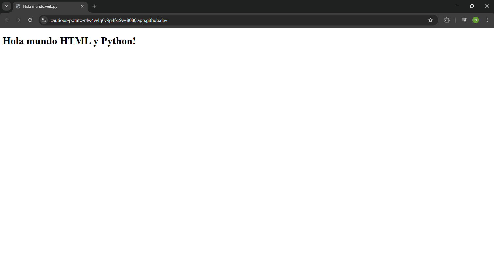
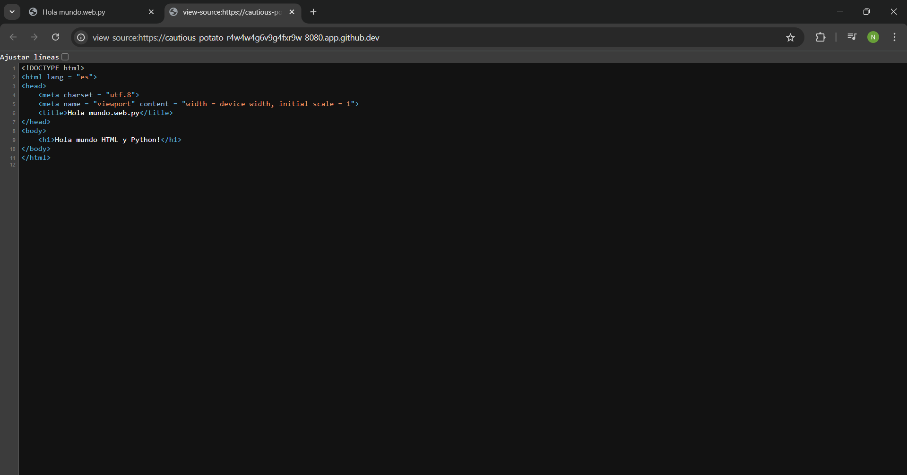

# 2 Templates

## 1. Templates en nuestra aplicación web
Aqui se muestra como se usan los **Templates** por medio de **HTML** en el sitio web **web.py Templator**.

En esta actividad, ocuparemos la misma clase **Index** y sus debidas respuestas gracias al método **GET**, que como recordamos, nos ayuda a renderizar la información que queremos ver en nuestro servidor web.

````python
import web

urls = (
    '/', 'Index'
)

render = web.template.render('templates')

app = web.application(urls, globals())

class Index:
    def GET(self):
        return render.index()

if __name__ == "__main__":
    app.run()
````


## 2. Modificación para que nuestro código tengas **Templates**
En esta modificación de código, ahora escribimos: **render = web.template.render('templates')**. esto debido a que ahora ocuparemos el lenguaje de programación **HTML** y necesitamos llamar al objeto **web.template.render**, ya que llamar a este objeto nos ayudará a definir una carpeta para que se puedan guardar los archivos de **HTML**, al igual que nos ayudará a renderizar la información que requerimos mostrar.

````python
render = web.template.render('templates')
````


## 3. La Página **index.html**
Necesitamos crear una carpeta llamada **templates**, y dentro de ella un archivo nuevo con el nombre **index.html**, dentro del archivo se escribirá lo siguiente

````html
<!DOCTYPE html>
<html lang = "es">
<head>
    <meta charset = "utf.8">
    <meta name = "viewport" content = "width = device-width, initial-scale = 1">
    <title>Hola mundo.web.py</title>
</head>
<body>
    <h1>Hola mundo HTML y Python!</h1>
</body>
</html>
````

### Nota:
Este ejemplo se tomó de la página [bootstrap](https://getbootstrap.com/docs/5.3/getting-started/introduction/)


# 4. Renderizar de **HTML**
Esta modificación nos ayudará a que al momento de entrar a la ruta **/**, esta llama a la clase **"index"**, y la clase hace que el método **GET** rendericé nuestro archivo de HTML llamado **"index.html"**.
````python
 return render.index()
 ````

 ### Nota:
 Recuerda que **index()** llama al archivo llamado **index.hmtl**, si el archivo se llamará **saludo.html** este llamaría a **saludo.html**.

 #### Imagen 1: Al entrar a nuestro servidor web:
 

 #### Imagen 2: Podemos ver el código fuente de nuestro servidor y nos damos cuenta que esta en HTML
 
 