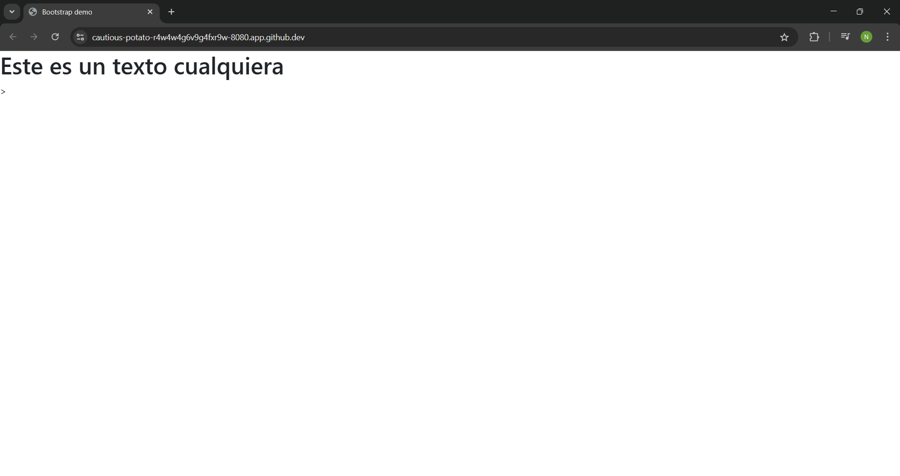
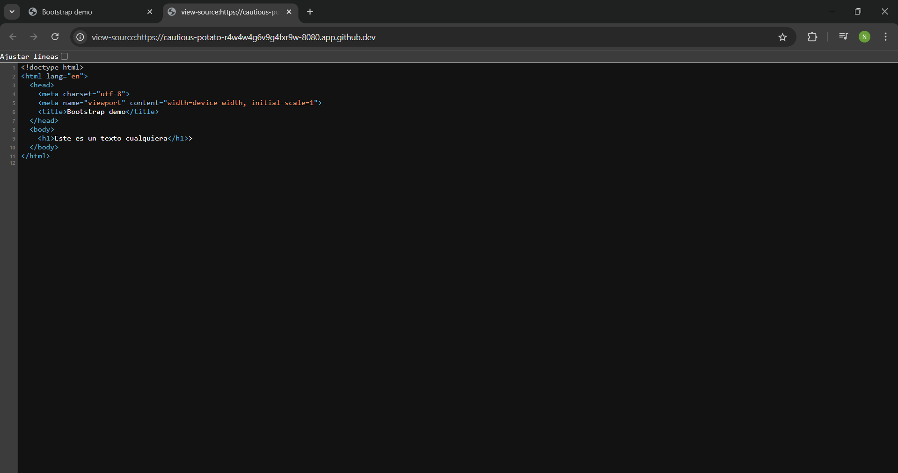

# 3. Template hacia HTML y los Datos

## 1. Datos y Templates
- Este código nos enseña el template que se esta ocupando en **HTML**, al igual, que se estan enviando datos desde el archivo **python**
- Como podemos notar, está la clase **Index**, la cual en la **aplicacion_02** vimos como esta llamaba al método **GET** para que pudiera renderizar la información que le pedíamos.

````python
import web

urls = (
    '/', 'Index'
)

render = web.template.render('templates')
app = web.application(urls, globals())

class Index:

    def __init__(self):
        self.mensaje = "Este es un texto cualquiera"

    def GET(self):
        return render.index(self.mensaje)

if __name__ == "__main__":
    app.run()
````


## 2. Está es la página **index.html** de **HTML** que recibe los datos
Como podemos ver, esta página nos ayuda a recibir un objeto desde **python** con web.py.

Para ello, podemos ver que esta escrito en la primer línea **$def with(data)**, este nos ayuda a dar una extensión para recibir el objeto de **python**.
````html
$def with(data)
<!DOCTYPE html>
<html lang="es">
    <head>
        <meta charset="utf-8">
        <meta name="viewport" content="width=device-width, initial-scale=1">
        <title>Hola mundo Web.py</title>
    </head>
    <body>
        <h1>$data</h1>
    </body>
</html>
````
### Nota: Recuerda que puedes ponerle el nombre que quieras a el objeto.

### Por ejemplo: En vez de **data** puede ser **info**.


## 3. Los datos se renderizarán
Los datos se recibirán gracias a **def with(data)** y el simbolo **$** lo ocupamos para que rendericé lo que contenga la variable.

````html
<h1>$data</h1>
````

Recuerda que se muestra el valor de la variable, no se mostrará la **$data** como si fuera un encabezado.


## 4. Rederizado de index.html enviando datos
Se renderiza la página **index.html** gracias a **def with(data)**, pero también se esta enviando un tipo de objeto **str** gracias a **(self.message)**.

Recuerda que se esta enviando hacia el archivo un tipo de objeto cualquiera, osea, puede ser **str**, **float**, **int**, **bool**, **list**, etc.

````python
return render.index(self.message)
````

### Imagen 1. Aquí podemos ver nuestro servidor web abierto:

### Imagen 2. 
Podemos notar en nuestro código abierto, que hemos podido renderizar nuestro archivo **html** y en la parte donde dice **$data**, no dice ello y en vez de ello dice lo que queriamos que dijera que es; **"Este es un texto cualquiera"**

